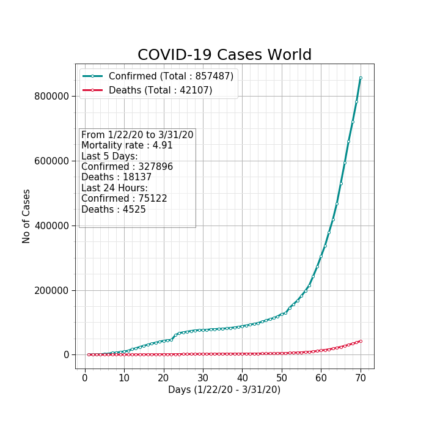

# COVID-19-CaseStudy-and-Predictions [](https://github.com/tarunk04/COVID-19-CaseStudy-and-Predictions/blob/master/LICENSE)
This repository is a case study, analysis, and visualization of COVID-19 Pandemic spread along with prediction models.
# Open to All
If you want to contribute to the notebook or any feedback and suggestions are most welcome. You can contact me on <b>[LinkedIn](https://www.linkedin.com/in/tarun-kumar-iit-ism/) </b>as well.
 
# Kaggle
[Follow me on Kaggle](https://www.kaggle.com/tarunkr)<br>
[View Latest Version](https://www.kaggle.com/tarunkr/covid-19-case-study-analysis-viz-comparisons)

Silent Features 
================
* Several visualizations of a time-series dataset of covid19 cases.   
* Case Study of the World and few countries, including India. 
* Forecast of a number of global confirmed cases and deaths.

Dataset
======
https://github.com/CSSEGISandData/COVID-19
<br>
2019 Novel Coronavirus COVID-19 (2019-nCoV) Data Repository by Johns Hopkins CSSE
This dataset is updated daily by Johns Hopkins CSSE.

Dataset consists of time-series data from 22 JAN 2020 to Till date (Updated on daily Basis).<br>
**Three Time-series dataset (Depricated):**
* time_series_19-covid-Confirmed.csv ([Link Raw File](https://raw.githubusercontent.com/CSSEGISandData/COVID-19/master/csse_covid_19_data/csse_covid_19_time_series/time_series_19-covid-Confirmed.csv))
* time_series_19-covid-Deaths.csv ([Link Raw File](https://raw.githubusercontent.com/CSSEGISandData/COVID-19/master/csse_covid_19_data/csse_covid_19_time_series/time_series_19-covid-Deaths.csv))
* time_series_19-covid-Recovered.csv ([Link Raw File](https://raw.githubusercontent.com/CSSEGISandData/COVID-19/master/csse_covid_19_data/csse_covid_19_time_series/time_series_19-covid-Recovered.csv))

**New Time-series dataset:**
* time_series_covid19_confirmed_global.csv ([Link Raw File](https://raw.githubusercontent.com/CSSEGISandData/COVID-19/master/csse_covid_19_data/csse_covid_19_time_series/time_series_covid19_confirmed_global.csv))
* time_series_covid19_deaths_global ([Link Raw File](https://raw.githubusercontent.com/CSSEGISandData/COVID-19/master/csse_covid_19_data/csse_covid_19_time_series/time_series_covid19_deaths_global.csv))

**New Dataset (Updated more frequently by web crawler of JHU):**
* cases_country.csv ([Link Raw File]("https://raw.githubusercontent.com/CSSEGISandData/COVID-19/web-data/data/cases_country.csv"))

Installation
================
* Clone this repository:  
```console
git clone https://github.com/tarunk04/COVID-19-CaseStudy-and-Predictions
```
or click `Download ZIP` in right panel of repository and extract it.
* Open latest version of notebook in **Jupyter Notebook**.


Visualization Preview
================


.png)


Prediction Preview
================
Global Conformed Case Prediction


### Prediction table
Prediction using the ML model for both global confirmed cases and deaths.<br>


<b>To get full insights and visualization see the notebook on KAGGLE [View Latest Version Notebook](https://www.kaggle.com/tarunkr/covid-19-case-study-analysis-viz-comparisons) </b>
# Authors
Tarun Kumar

#### Authors' Note:<br>
The author has tried to get the best result using the dataset. The author is not responsible for any misuse. Any commercial use of the code is not permissible. Read Licence carefully.
If you want to contribute to the notebook or any feedback and suggestions are most welcome.

# Licence
The MIT License, see the included, see the [License](https://github.com/tarunk04/COVID-19-CaseStudy-and-Predictions/blob/master/LICENSE) file.
